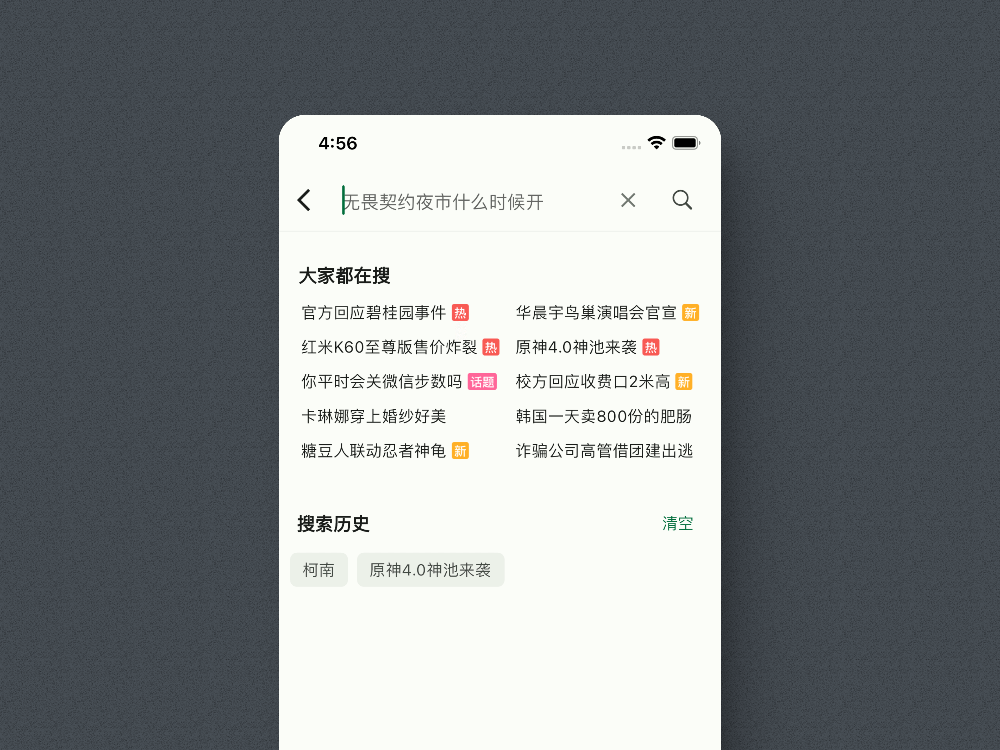
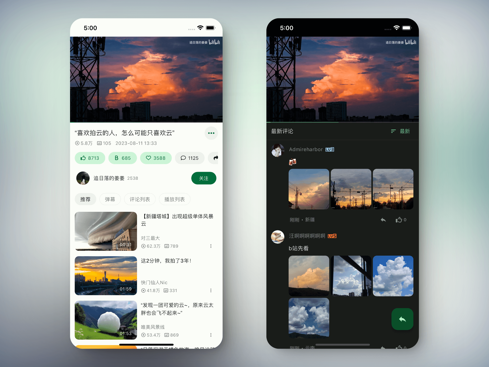
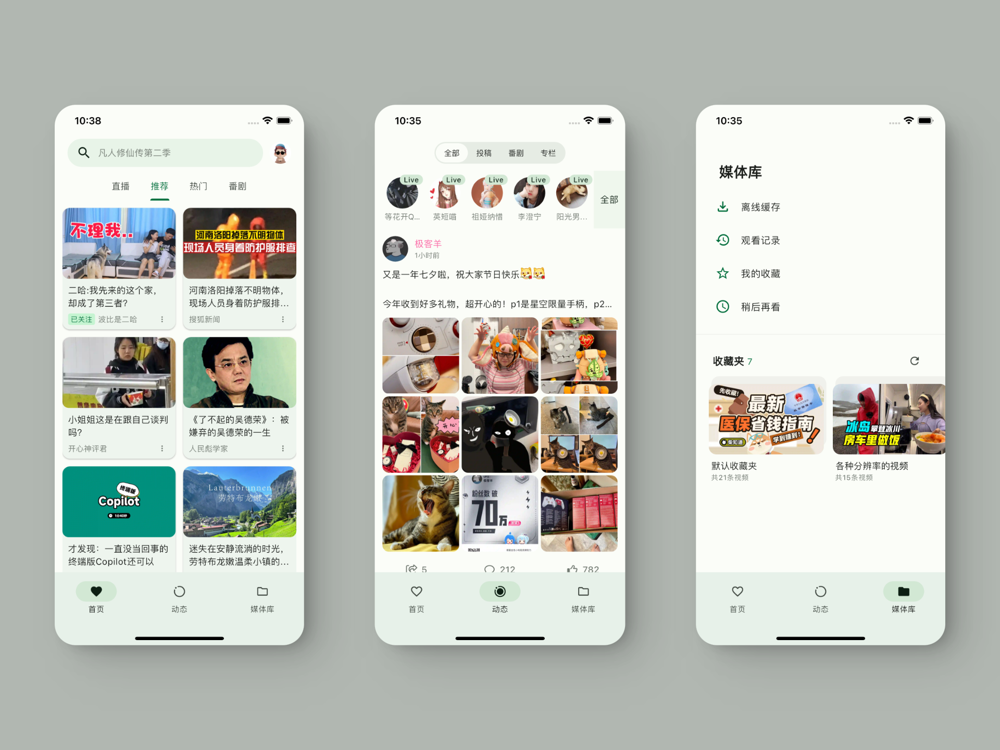

    

    <h1>PiliMax</h1>

    

    
 PiliPlus 第三方Fork自用版本，目前的修改只针对安卓版本 

    
 其他版本构建时也会顺便一起构建，但是大概率有 BUG ，如有需要请自行Fork后修改编译 

    

 

 

 

## 项目说明
- 本项目 PiliMax 是基于上游项目 PiliPlus 及 PiliNara 的个人自用版本，保留主要功能并进行了一些自用优化和调整。
- 本项目会按需同步上游更新，并在此基础上进行修改和优化。
- 目前只打包了安卓版本，其他版本构建时也会顺便一起构建，但是大概率有 BUG 。
- 本项目仅供个人学习和测试使用，如有需要请自行Fork后修改编译。

在此致敬原作者和上游作者的无私奉献。如有侵权请联系删除。

# 近期改动
## 本项目特性(修改)

- [x] 自动缓存清理：新增自动清理缓存功能，支持周期可选。
- [x] 动态页体验优化：优化 UP 主切换与滑动切换流畅度；新增动态文本关键词过滤。
- [x] 内容过滤强化：完善过滤豁免规则与屏蔽优先级，调整首页推荐流默认行为与相关设置。
- [x] 应用内悬浮小窗：新增应用内悬浮小窗播放服务；修复小窗模式下播放器状态不一致问题。
- [x] 新增听视频模式：优化页面切换时的播放衔接体验，修复听视频模式下播放进度不同步问题。
- [x] 播放体验优化：手动切集时自动显示播放控件；优化长按视频预览弹窗交互与封面元数据展示。
- [x] 交互细节打磨：图片长按菜单新增复制图片功能；评论、动态发送的风控提示优化。
- [x] 页面恢复机制优化：新增 Android 后台被杀后的单页面恢复能力。
- [x] 多场景返回适配：优化 Android 预测性返回手势，覆盖评论区、回复详情、预览弹窗等场景。
- [x] MMKV 热存储：Android 由单纯性能优化升级为带完整迁移保护、数据安全兜底的 MMKV 方案。
- [x] 添加 Hero 卡片展开动画：统一卡片展开与骨架入场动画进度，实现卡片一体舒展铺开的流畅过渡效果。
- [x] 直播能力增强：优化直播间仅音频与画面切换体验。
- [x] 崩溃捕获与历史：优化了错误日志的报告输出。
- [x] 剪贴板视频链接：优化了剪切板的视频链接跳转。
- [ ] 其他，等等...

 

## 下载

可以通过右侧 [releases](https://github.com/ekmope/PiliMax/releases) 进行下载或拉取代码到本地进行编译

 

## 声明

此项目（PiliMax）是个人为了兴趣而开发，仅用于学习和测试，请于下载后24小时内删除。
所用API皆从官方网站收集，不提供任何破解内容。
- 在此致敬原作者：[guozhigq/pilipala](https://github.com/guozhigq/pilipala)
- 在此致敬上游作者：[orz12/PiliPalaX](https://github.com/orz12/PiliPalaX)
- 在此致敬上游作者：[bggRGjQaUbCoE/PiliPlus](https://github.com/bggRGjQaUbCoE/PiliPlus)
- 在此致敬上游作者：[Starfallan/PiliNara](https://github.com/Starfallan/PiliNara)
- 在此致敬上游作者：[staoran/PiliPlus](https://github.com/staoran/PiliPlus)
- 在此致敬上游作者：[Chloemlla/PiliPlus](https://github.com/Chloemlla/PiliPlus/)
- 本仓库做了一些自用修改，感谢原作者及其它作者的开源精神。

感谢使用

 

## 致谢

- [bilibili-API-collect] (https://github.com/SocialSisterYi/bilibili-API-collect)
- [flutter_meedu_videoplayer] (https://github.com/zezo357/flutter_meedu_videoplayer)
- [media-kit] (https://github.com/media-kit/media-kit)
- [dio] (https://pub.dev/packages/dio)
- 等等

 
 
 
